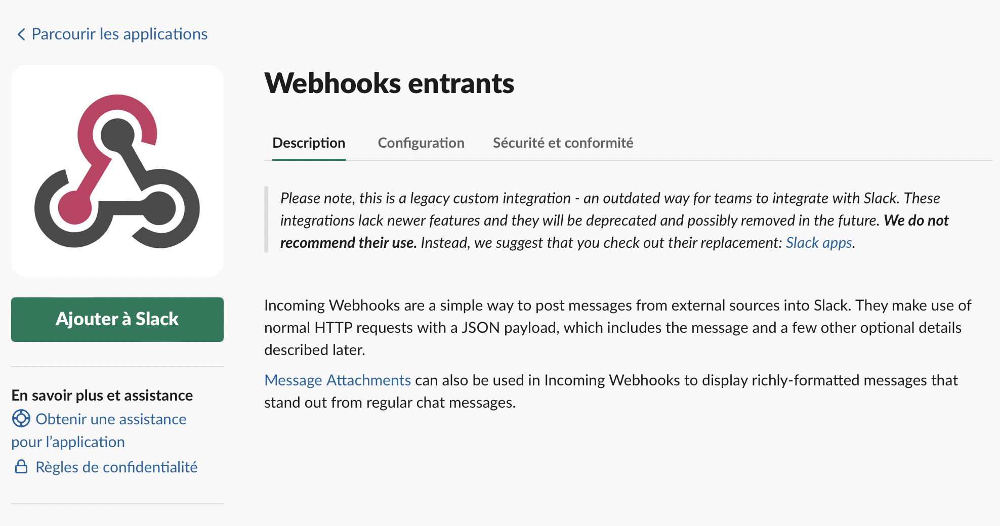
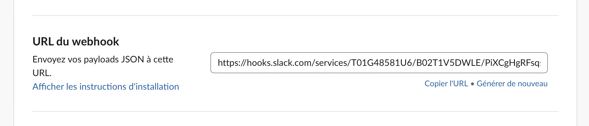
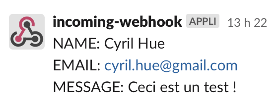

# Send to Slack

## Configuration

- Enabled a webhook on slack application `Webhooks entrants`
- Copy `.env` file and rename it to `.env.local`
- Copy past webhook url in `.env.local` in var `REACT_APP_SLACK_WEBHOOK_URL`




## Launch the app

```bash
npm i
npm start
```

- Got to `http://localhost:3000/`
- Try it !



## Any questions ?

Contact me ;)
